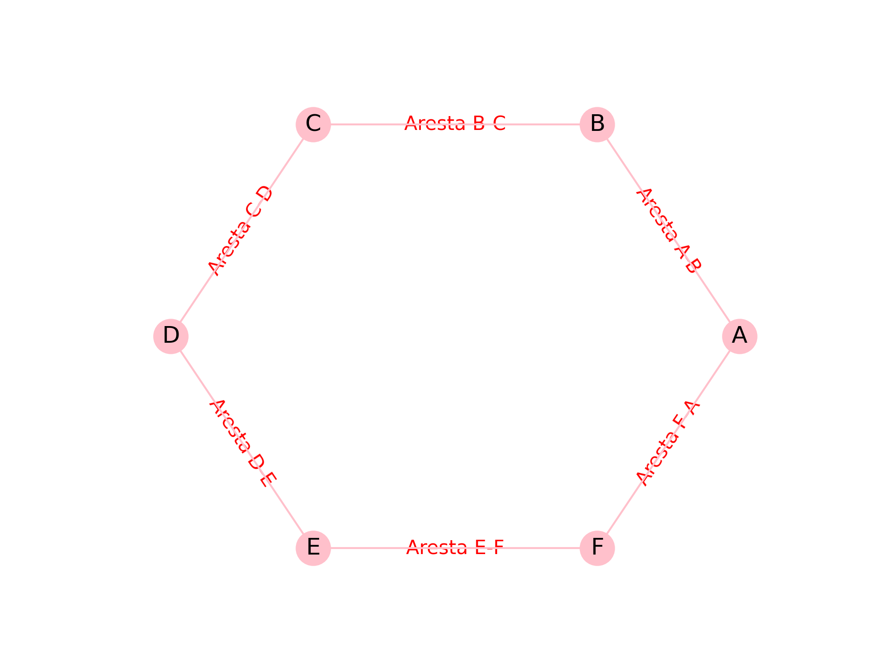

# Teoria dos Grafos Aplicada a Python

Este projeto demonstra implementações de grafos em Python, permitindo a criação, manipulação e consulta de grafos direcionados ou não direcionados, tanto de forma manual quanto utilizando a biblioteca NetworkX para visualização.

---

## 📄 Destaque: Visualização Passo a Passo da Busca em Profundidade

O arquivo [`GrafoPassoAPasso.pdf`](GrafoPassoAPasso.pdf) contém uma sequência de imagens mostrando cada etapa da busca em profundidade (DFS) em um grafo direcionado, facilitando o entendimento visual do algoritmo.

---

## Estrutura do Projeto

- [`uso-collections/Grafo.py`](uso-collections/Grafo.py): Contém a classe [`grafo`](uso-collections/Grafo.py), responsável pela estrutura e operações do grafo.
- [`uso-collections/Aresta.py`](uso-collections/Aresta.py): Exemplo de uso da classe [`grafo`](uso-collections/Grafo.py), criando um grafo direcionado a partir de uma lista de arestas e realizando operações básicas.
- [`uso-networkx/Grafo.py`](uso-networkx/Grafo.py): Exemplo de criação e visualização de um grafo utilizando a biblioteca NetworkX e Matplotlib, gerando uma imagem do grafo.
- [`busca-por-profundidade/desenhar-grafo.py`](busca-por-profundidade/desenhar-grafo.py): Implementação da busca em profundidade (DFS) com visualização passo a passo, gerando imagens e um PDF com cada etapa do algoritmo.
- [`meu_grafo.png`](meu_grafo.png): Imagem gerada pelo script [`uso-networkx/Grafo.py`](uso-networkx/Grafo.py) mostrando a visualização do grafo.
- [`GrafoPassoAPasso.pdf`](GrafoPassoAPasso.pdf): PDF com as etapas da busca em profundidade.
- `__pycache__/`: Diretório gerado automaticamente pelo Python para armazenar arquivos compilados.

## Funcionalidades

- Criação de grafos direcionados ou não direcionados.
- Adição de arestas.
- Consulta de vértices e arestas.
- Verificação da existência de uma aresta entre dois vértices.
- Representação do grafo por meio de dicionário de adjacências.
- Visualização gráfica de grafos com NetworkX e Matplotlib.
- **Visualização passo a passo da busca em profundidade (DFS), com geração de imagens e PDF.**

## Exemplo de Uso (Implementação Manual)

Veja o arquivo [`uso-collections/Aresta.py`](uso-collections/Aresta.py) para um exemplo prático:

```python
from Grafo import grafo

# Lista de arestas (origem, destino)
aresta = [('A', 'B'), ('B', 'C'), ('C', 'B'), ('D', 'A'), ('E', 'B')]

# Criação de um grafo direcionado
criar_grafo = grafo(aresta, direcionado=True)
print(criar_grafo.adj) # representação do grafo

print(criar_grafo.get_vertice())  # lista de vértices
print(criar_grafo.get_aresta())   # lista de arestas
print(criar_grafo.existe_aresta('A', 'B'))  # Verifica se existe a aresta de A para B
print(criar_grafo.existe_aresta('E', 'C'))  # Verifica se existe a aresta de E para C
```

## Exemplo de Visualização com NetworkX

Veja o arquivo [`uso-networkx/Grafo.py`](uso-networkx/Grafo.py) para um exemplo de visualização gráfica:

```python
import matplotlib.pylab as grafico
import networkx as bibliotecaNetworkx

grafo = bibliotecaNetworkx.Graph()
grafo.add_node("A")
grafo.add_node("B")
grafo.add_node("C")
grafo.add_node("D")
grafo.add_node("E")
grafo.add_node("F")
grafo.add_edge("A", "B")
grafo.add_edge("B", "C")
grafo.add_edge("C", "D")
grafo.add_edge("D", "E")
grafo.add_edge("E", "F")
grafo.add_edge("F", "A")
posicionamento = bibliotecaNetworkx.circular_layout(grafo)
bibliotecaNetworkx.draw_networkx_edge_labels(
    grafo,
    posicionamento,
    edge_labels={
        ("A", "B"): "Aresta A-B",
        ("B", "C"): "Aresta B-C",
        ("C", "D"): "Aresta C-D",
        ("D", "E"): "Aresta D-E",
        ("E", "F"): "Aresta E-F",
        ("F", "A"): "Aresta F-A"
    },
    font_color="red"
)
bibliotecaNetworkx.draw(
    grafo,
    with_labels=True,
    pos=posicionamento,
    node_color="pink",
    edge_color="pink"
)
grafico.savefig("meu_grafo.png", format="png", dpi=300)
grafico.close()
```

## Exemplo de Busca em Profundidade com Visualização Passo a Passo

Veja o arquivo [`busca-por-profundidade/desenhar-grafo.py`](busca-por-profundidade/desenhar-grafo.py) para um exemplo de implementação da busca em profundidade (DFS) com geração de imagens e PDF:

```python
import matplotlib.pyplot as plt
import networkx as nx
from matplotlib.backends.backend_pdf import PdfPages

# ...código para desenhar o grafo e executar a busca em profundidade...

pdf = PdfPages("GrafoPassoAPasso.pdf")
# O PDF será salvo automaticamente com todas as etapas da busca.
pdf.close()
```

## Visualização Gerada

Abaixo está a imagem gerada pelo script [`uso-networkx/Grafo.py`](uso-networkx/Grafo.py):



---

**Para ver a execução passo a passo da busca em profundidade, abra o arquivo [`GrafoPassoAPasso.pdf`](GrafoPassoAPasso.pdf)!**